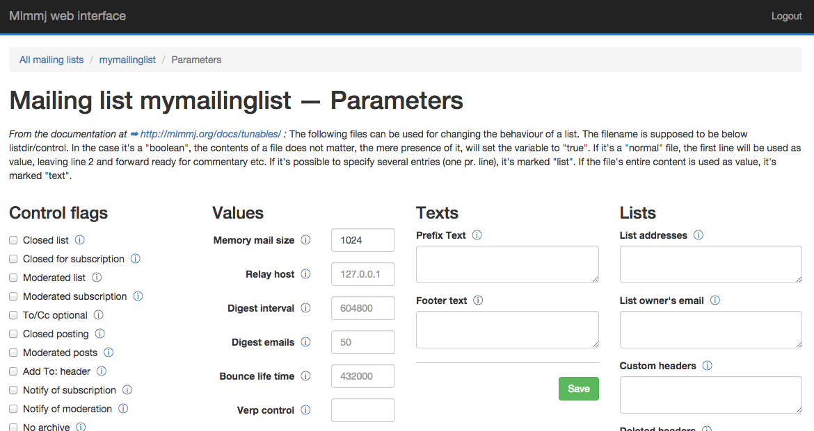

<!--
Nota bene : ce README est automatiquement généré par <https://github.com/YunoHost/apps/tree/master/tools/readme_generator>
Il NE doit PAS être modifié à la main.
-->

# Mlmmj Web pour YunoHost

[](https://ci-apps.yunohost.org/ci/apps/mlmmj-web/)  

[](https://install-app.yunohost.org/?app=mlmmj-web)

*[Lire le README dans d'autres langues.](./ALL_README.md)*

> *Ce package vous permet d’installer Mlmmj Web rapidement et simplement sur un serveur YunoHost.*  
> *Si vous n’avez pas YunoHost, consultez [ce guide](https://yunohost.org/install) pour savoir comment l’installer et en profiter.*

## Vue d’ensemble

A very simple web frontend in node for mlmmj.

**Version incluse :** 0.0.1~ynh1

## Captures d’écran



## Documentations et ressources

- Site officiel de l’app : <http://mlmmj.org>
- Dépôt de code officiel de l’app : <https://github.com/ashledombos/mlmmj-simple-web-interface>
- YunoHost Store : <https://apps.yunohost.org/app/mlmmj-web>
- Signaler un bug : <https://github.com/YunoHost-Apps/mlmmj-web_ynh/issues>

## Informations pour les développeurs

Merci de faire vos pull request sur la [branche `testing`](https://github.com/YunoHost-Apps/mlmmj-web_ynh/tree/testing).

Pour essayer la branche `testing`, procédez comme suit :

```bash
sudo yunohost app install https://github.com/YunoHost-Apps/mlmmj-web_ynh/tree/testing --debug
ou
sudo yunohost app upgrade mlmmj-web -u https://github.com/YunoHost-Apps/mlmmj-web_ynh/tree/testing --debug
```

**Plus d’infos sur le packaging d’applications :** <https://yunohost.org/packaging_apps>
